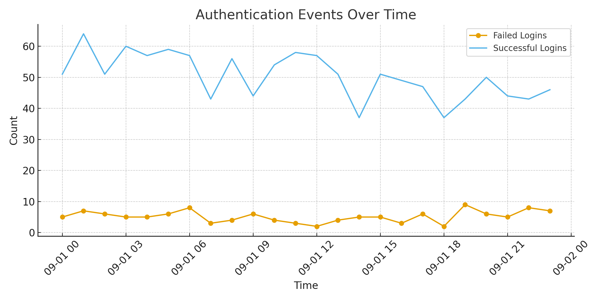
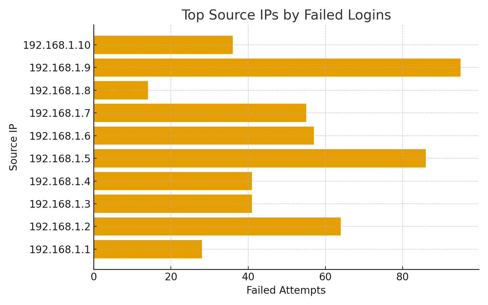
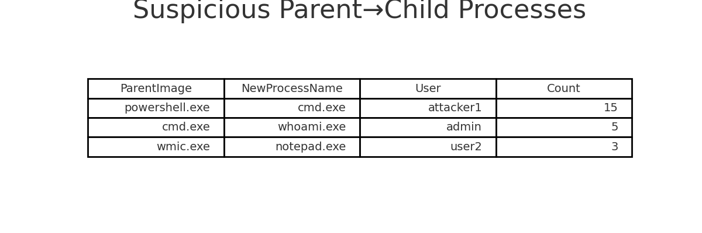
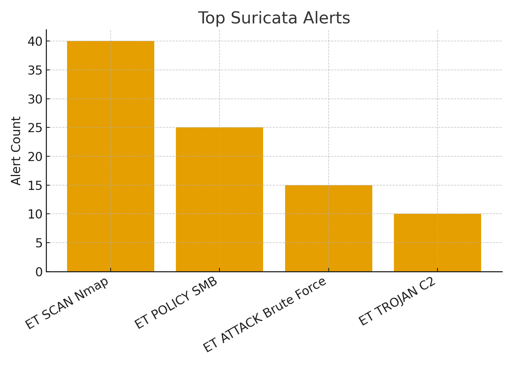
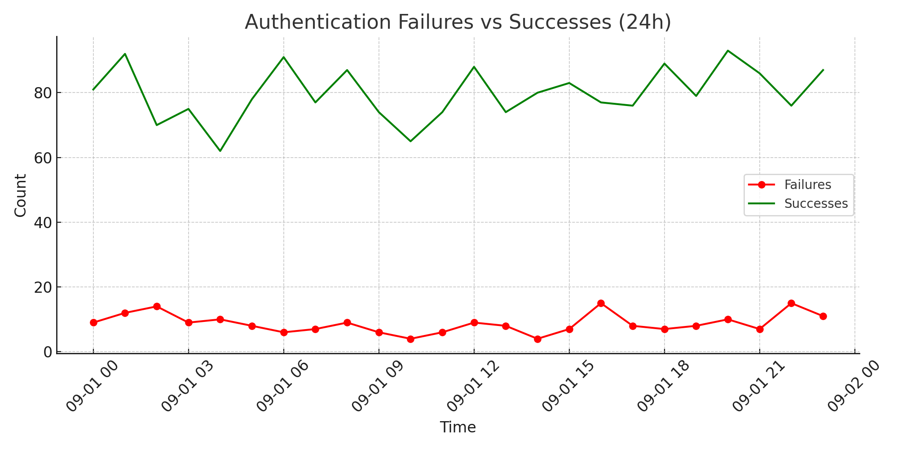
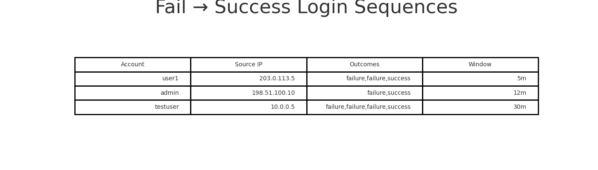
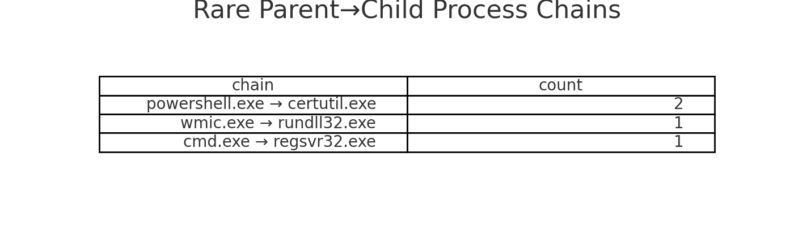
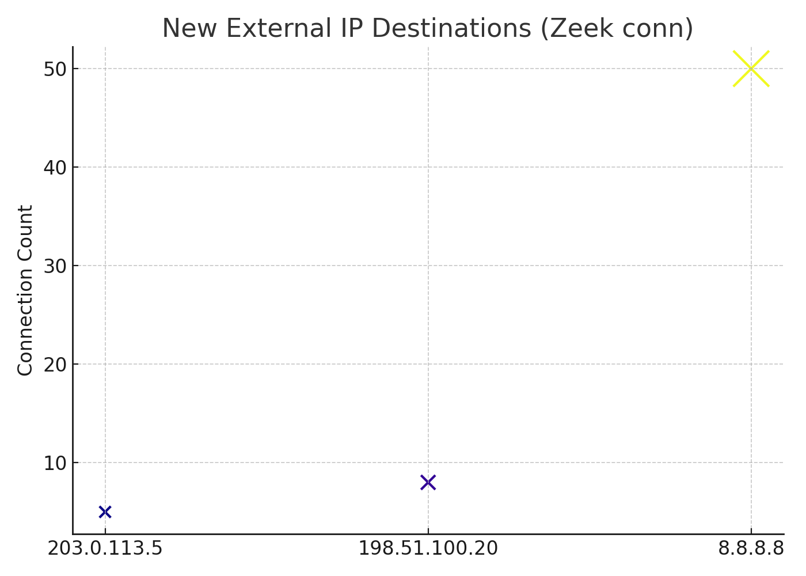

# 🔍End-to-End Log Analysis & Threat Hunting

This repository demonstrates how a SOC analyst performs log analysis in Splunk. It is based on my homelab setup with **Splunk, Sysmon, Suricata, Zeek, and Nessus**, and mirrors workflows used in enterprise SOC environments.

---

## 📂 Repository Structure

```
.
├── dashboards/
│   ├── soc_analyst_overview.json          # Overview dashboard with 5 panels
│   ├── auth_windows_triage.json           # Authentication triage (fail/success, geo-IP, sequences)
│   └── threat_hunting_rare_first_seen.json # Threat hunting (rare processes, DNS, external IPs)
│
├── configs/
│   ├── macros.conf                        # Centralized macros for indexes/thresholds
│   ├── savedsearches.conf                 # Ready-to-use SOC saved searches/alerts
│   └── transforms.conf                    # Lookup definitions
│
├── lookups/
│   ├── asn_lookup.csv                     # IP → ASN/Org enrichment
│   ├── known_good_processes.csv           # Whitelisted system processes
│   ├── known_admin_tools.csv              # Dual-use admin tools
│   └── known_dns_whitelist.csv            # DNS allowlist
│
├── screenshots/                           
│   ├── failed_logins_over_time.png
│   ├── top_failed_ips.png
│   ├── suspicious_processes.png
│   ├── suricata_alerts.png
│   ├── auth_failures_vs_successes.png
│   ├── fail_success_sequences.png
│   ├── geo_asn_enrichment.png
│   ├── rare_parent_child.png
│   └── new_external_ips.png
│
├── README_IMPORT.md                       # How to import dashboards, macros, saved searches
├── README_LOOKUPS.md                      # How to use enrichment/whitelisting lookups
└── README.md                              # (this file) Full workflow + repo overview
```

---

## 1. Log Ingestion

* **Sources**:

  * Windows Event Logs (via Sysmon + Splunk Universal Forwarder)
  * Suricata alerts (JSON logs)
  * Zeek logs (conn.log, dns.log, http.log)
* **Normalization**:

  * Apply sourcetypes (`WinEventLog:Security`, `suricata:json`, `zeek:conn`).
  * Use Splunk CIM (Common Information Model) for consistent field naming.

---

## 2. Baseline Queries

```spl
index=wineventlog sourcetype=WinEventLog:Security EventCode=4624
| stats count by Account_Name, Logon_Type, src_ip
```

---

## 3. Brute Force / Authentication Attacks

```spl
index=wineventlog sourcetype=WinEventLog:Security EventCode=4625
| stats count by Account_Name, src_ip
| where count > 10
```

Maps to MITRE ATT\&CK: **T1110 – Brute Force**.

---

## 4. Suspicious Process Execution

```spl
index=sysmon EventCode=4688
| stats count by ParentImage, NewProcessName, User
| where like(ParentImage, "%powershell.exe") AND like(NewProcessName, "%cmd.exe")
```

---

## 5. Network Reconnaissance

```spl
index=suricata sourcetype=suricata:json event_type=alert signature="ET SCAN*"
| stats count by src_ip, dest_ip, signature
```

---

## 6. DNS Beaconing

```spl
index=zeek sourcetype=zeek:dns
| stats count by query, src_ip
| where count > 50
```

---

## 7. Correlation Search

```spl
(index=wineventlog EventCode=4625 src_ip=*)
OR
(index=suricata event_type=alert src_ip=*)
| stats values(EventCode) values(signature) by src_ip
```

---

## 8. Dashboards

### SOC Analyst Overview






### Windows Authentication Triage




### Threat Hunting — Rare & First-Seen




---

## 9. Incident Workflow

1. **Verify** — Check logs, timeline, affected assets.
2. **Enrich** — Add IP reputation, CVE lookup, user history.
3. **Contain** — Disable accounts, block IPs, isolate endpoints.
4. **Report** — Document incident with MITRE & NIST mapping.

---

## 10. SOC-Style Reporting Template

* **Summary**: Detected brute-force attempt on RDP from IP x.x.x.x.
* **Detection Source**: Splunk correlation search + Sysmon EventCode 4625.
* **Mapped TTPs**: MITRE ATT\&CK T1110.
* **Impact**: Account lockouts, potential lateral movement.
* **Response**: Blocked IP, reset credentials, reviewed access logs.
* **Lessons Learned**: Rule tuning, MFA enforcement.

---

## 📸 Screenshots

All screenshots are included in the `screenshots/` folder and referenced inline above.

---

This repo shows how raw logs are turned into **actionable intelligence**, the core responsibility of a SOC analyst, and demonstrates hands-on skills with Splunk, Sysmon, Suricata, Zeek, and Nessus.
